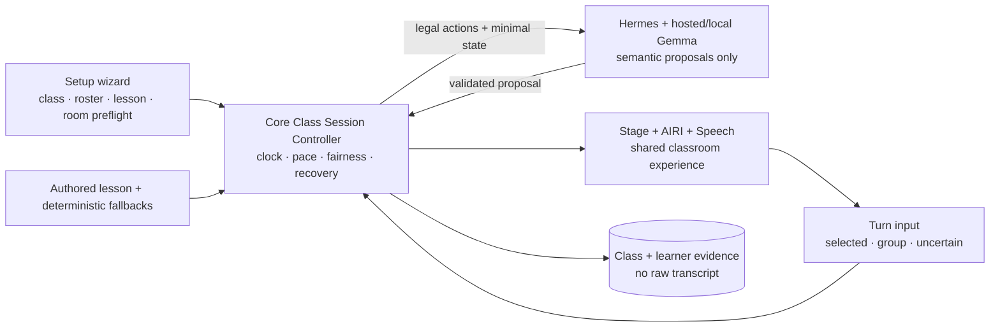

# CTO audit — từ Option B tới Autonomous Classroom Product

**Ngày:** 2026-08-12  
**Loại:** code-grounded product/architecture/release research  
**North Star:** competition-ready **Autonomous Classroom Product**, không phải chatbot, personal tutor hay scripted demo

## Executive verdict

Option B là ranh giới runtime đúng và nên được giữ:

```text
Classroom Core (authority) ← Bright MCP → Hermes (reasoning runtime)
          │                                  │
          ├─ lesson/state/memory             └─ hosted model now,
          └─ Stage/AIRI + Speech                 local Gemma later
```

Bright hiện có runtime floor Protocol v3 đã được kiểm tra cơ học: authored fallback,
Core authority, class/session + roster/fairness, turn/capture correlation, capability
leases, conservative grading, Hermes adapter với đúng một terminal proposal tool,
single speech owner, answer station và local-model seam. Việc tiếp theo **không phải
nối thêm agent** và cũng không phải copy Hermes vào AIRI.

Khoảng cách tới North Star bây giờ là product truth:

1. session spine đã quản lý roster/attendance/fairness, nhưng class-aware memory và
   checkpoint restore chưa hoàn thiện;
2. stage budget/recovery metadata đã có nhưng chưa được thực thi hết thành pacing policy;
3. lesson 37–39 phút đã compile/play qua mọi path nhưng vẫn là curriculum draft,
   approver chưa được chỉ định;
4. voice path mới chứng minh một sampled answer-station turn bằng synthetic/mock;
5. smoke chưa chạy composed browser/audio/provider/room thật;
6. appliance chưa chứng minh power-loss resume hoặc rollback toàn stack;
7. chưa đủ consent, licence, provenance và learning evidence để ship.

Vì vậy, đơn vị sản phẩm đúng cho cuộc thi là **một tiết học 35–45 phút tự chủ**, dù
trên sân khấu chỉ trình diễn một đoạn. Người lớn chỉ setup, quản lý phòng và dùng
emergency controls; không chọn nhánh dạy, không giữ mic cho từng câu, không sửa flow
để demo tiếp tục.

## North Star, viết thành product contract

Bright competition-ready phải chứng minh đồng thời:

- một AI teacher quản lý 20–40 trẻ quanh một shared board;
- chạy local/offline trên Intel target và vẫn dạy hết bài khi Hermes/model/network chết;
- phản xạ board dưới 100 ms không đi qua model;
- tự điều tiết nhịp, participation, gọi học sinh, recovery và kết thúc buổi học;
- không nói một trẻ “đúng” khi evidence không đủ;
- nhớ learner state có cấu trúc nhưng không biến transcript/chat history thành truth;
- một facilitator mới có thể setup, start và emergency-stop mà không được hướng dẫn.

Năm luật NS-1…NS-5 trong [North Star](../../NORTH-STAR.md) vẫn là doctrine.
“Autonomous” không thay NS-1; nó được xây **trên** authored lesson hoàn chỉnh.

## Evidence trong codebase

### Những gì đã đúng

- Core là authority; Hermes chỉ đề xuất qua MCP và bị revalidate.
- Hosted/local provider nằm sau Hermes profile, không rò vào Core/UI/content.
- Authored lesson, state generation và deterministic feedback tạo được đường NS-1.
- Stage là audio owner, Control là mic owner; speech turns có correlation/cancel/ACK.
- `hosted_semantic` chỉ gửi graded outcome cho Hermes; raw transcript không vào hosted
  context hay durable learner memory. Chỉ `synthetic_dev` có ack + fixture ID mới cho
  raw synthetic transcript đi qua.
- systemd, kiosk, USB update và diagnostics đã tạo nền appliance ban đầu.

### Những gì chưa phải classroom product

| Gap | Evidence | Product consequence |
|---|---|---|
| Memory theo lớp chưa đủ | Roster/ledger đã có; longitudinal class-aware memory chưa hoàn thiện | Chưa chứng minh nhớ và điều chỉnh qua nhiều session |
| Pacing/recovery thực thi chưa đủ | Metadata stage budget/recovery có; controller chưa dùng hết | Chưa chứng minh AI sở hữu toàn bộ nhịp 35–45 phút |
| Curriculum chưa được duyệt | Market Food chạy 37–39 phút nhưng status `draft`, approver unassigned | Không thể gọi đây là lesson release hoặc learning evidence |
| Answer station mới một turn | Assignment/capture đã nối cho sampled individual speech | Chưa chứng minh toàn bộ oral arc tự vận hành |
| Recovery UX mới mock | Setup/status/emergency và recovery cue đã có | Chưa có first-time facilitator/room evidence |
| Smoke không composed | Python client tự phát playback ACK; fake speech | Không chứng minh AIRI/Piper/ASR/browser/Hermes cùng chạy |
| Speech failure advances silently | Chromium live flow với speech service down vẫn chuyển activity | Hệ thống “chạy” nhưng không còn dạy; cần capability gate và safe pause |
| Checkpoint chưa restore | Core ghi checkpoint nhưng startup chưa restore/resume | Core restart/power cut vẫn mất đúng teaching state |
| Update không atomic toàn stack | content/model nằm ngoài app release switch | App rollback vẫn có thể dùng content/model không tương thích |
| Release chưa reproducible | Không CI; Python/appliance deps chưa locked | Số test thủ công không phải release authority |
| Legal/privacy incomplete | Không root LICENSE/NOTICE/SBOM/consent workflow | Chưa thể phân phối hoặc thu dữ liệu trẻ em một cách có trách nhiệm |

### Implementation checkpoint sau audit

Protocol/toolchain đã được nâng lên v3 và self-test xanh. Bằng chứng snapshot: Core
224; agent 82 non-live + 4 live-provider deselected; AIRI 165; Chromium v3 mock 2;
content 7 + self-test. Pinned Hermes là `0.20.0+bright.1`, upstream
`03fa32c92dd445eb64c7f67434dd91b32c40701d`. Các số này chứng minh contract và logic
tất định, không chứng minh classroom/provider/hardware thật.

## Sản phẩm mỏng nhất nhưng trung thực

Không dùng face recognition, speaker biometrics hoặc camera identity cho phiên bản đầu.
Chúng tạo accuracy/privacy risk trước khi chứng minh được giá trị.

Vertical slice đề xuất:

- roster 20–40 trẻ, attendance và seat/answer-position mapping;
- AI tự chọn và gọi một em theo deterministic fairness queue;
- mic định hướng/handheld ở answer position; capture kế tiếp thuộc em đang được gọi;
- choral/group response chỉ là class signal, không ghi observation cá nhân;
- pair/group work là bắt buộc: 40 trẻ trong 45 phút chỉ có trung bình 67.5 giây/em;
- một lesson communicative hoàn chỉnh 35–45 phút, có timebox và recovery;
- teacher/facilitator chọn class + lesson, chạy preflight, bấm Start, rồi chỉ quan sát;
- Pause/Emergency/Resume là happy-path safety; Back/Skip/Takeover là recovery/debug,
  có reason và audit trail;
- Hermes chết giữa giờ vẫn hoàn thành lesson; local Gemma là provider migration, không
  phải kiến trúc mới.

Wedge đầu tiên hợp lý để khóa content: **Việt Nam, lớp 4, beginner/pre-A1 → A1,
một communicative unit**. Đây là quyết định sản phẩm cần curriculum owner xác nhận,
không phải giả định kỹ thuật.

## Kiến trúc sản phẩm cần bổ sung



`ClassSessionController` phải là Core-owned aggregate, gồm:

- `class`, `roster`, `attendance`, `session_participants`;
- session clock, activity/stage budget và pace checkpoints;
- `turn_assignment`: selected individual / group / anonymous / uncertain;
- participation ledger, cooldown, fairness queue và students-to-check;
- silence/noise/two-speaker/confused-class/failed-activity recovery ladder;
- lesson checkpoint có thể persist/resume;
- closure/exit-check policy.

Hermes có thể chọn trong legal actions. Hermes không sở hữu fairness, timer, roster,
memory attribution, liveness hay quyền kết thúc lesson.

## Product and competition research

### Competitive position

Offline content không phải moat: Kolibri đã có offline distribution, curriculum
authoring và triển khai rộng. Personal speaking products như Duolingo/ELSA và tutor
products như Khanmigo không giải bài toán một-to-many trên shared stage. Moat cần
chứng minh là:

> autonomous one-to-many oral classroom orchestration + deterministic survival +
> privacy-safe learner evidence trên phần cứng local rẻ.

Intel 2025 cũng đã có một offline educational RAG winner. Do đó “offline AI tutor”
không đủ khác biệt; classroom autonomy và field evidence mới là claim mạnh.

### Gemma 4 / OpenVINO

Gemma 4 có model variants hỗ trợ audio input và function calling, nhưng model
capability không đồng nghĩa Hermes/OVMS transport hiện tại chạy audio/tool calling
đúng, nhanh và ổn định. OVMS 2026.2 mới ghi nhận initial Responses support và Gemma 4
tool parsers. Quyết định đúng vẫn là:

- giữ dedicated ASR làm canonical ở NOW;
- conformance hosted → local Gemma qua cùng Hermes adapter;
- benchmark native audio như một `AsrProvider` sau, không nối thẳng audio vào Core;
- không chuyển `local-trusted` cho đến khi endpoint, policy, tool schema, latency,
  cancellation, RSS và thermal đều qua gate trên target Intel box.

### Child safety và governance

UNICEF yêu cầu safety, privacy, fairness, transparency/accountability, inclusion và
best interests of the child. UNESCO nhấn mạnh human-centred, age-appropriate use và
pedagogical validation. Với Bright, điều đó chuyển thành yêu cầu sản phẩm:

- guardian/institution consent, withdrawal, retention, delete/export/correct;
- không raw audio/transcript persistence mặc định;
- không biometrics trong first slice;
- uncertain thay vì false praise;
- bounded agent, auditable decisions, adult emergency authority;
- consented corpus trước mọi release claim về child speech.

### Licensing

Repo chưa có root LICENSE/NOTICE/SBOM hoặc machine-readable asset provenance. Avatar
mẫu Live2D không phải distribution plan; license phụ thuộc entity/use/distribution và
có thể cần review riêng cho AI/chatbot application. Competition build cần asset do
dự án sở hữu hoặc quyền phân phối được xác nhận bằng văn bản.

### Claim cần xác minh

North Star hiện ghi “Intel × UN competition”. Trang chính thức Intel mô tả festival
và các partnership nhưng chưa đủ để kết luận UN là đồng tổ chức. Trước public deck,
phải lấy exact rulebook/organizer wording và dùng đúng tên pháp lý.

## Unknown unknowns và kill risks

1. **Room acoustics:** loa có thể được mic nghe rõ hơn trẻ; browser AEC không phải proof.
2. **Interaction economics:** một mic không thể cho 40 trẻ luyện cá nhân đủ nhiều;
   lesson phải thiết kế chorus/pair/group và sampled retrieval ngay từ đầu.
3. **Curriculum ownership:** không có giáo viên/người duyệt rubric thì engineering sẽ
   tối ưu mechanics quanh content giả.
4. **Learning claim:** engagement và test pass không chứng minh learning; cần delayed
   retrieval và transfer task.
5. **Facilitator trust:** console quá nhiều nút có thể tạo thói quen co-teach và che
   lỗi autonomy.
6. **Appliance entropy:** power, disk, thermal, browser, audio device và USB update có
   thể thất bại khác hoàn toàn dev laptop.
7. **Local model:** tool score công khai không đảm bảo constrained classroom policy.
8. **Distribution rights:** “được dùng miễn phí” không có nghĩa được bundle/donate.

## Release evidence model

Không dùng một cột `done`. Mỗi capability phải có bốn trạng thái độc lập:

| State | Nghĩa |
|---|---|
| Implemented | Code path tồn tại |
| Mechanically tested | Unit/integration/E2E tái tạo được |
| Room validated | Đã chạy với người, âm học và target hardware thật |
| Legally shippable | Consent, licence, provenance, notices và policy hoàn tất |

Docs hiện đang trộn các trạng thái này; roadmap mới dùng release gates thay vì phần
trăm hoàn thành.

## Chromium UI/UX findings

Audit chạy Chromium thật ở Stage `1920×1080`, `1366×768`, `1024×768` và Control
`1366×768`, `1024×768`, gồm mock interaction và live Core/WebSocket flow.

Điểm tốt: Stage có hierarchy rõ, chữ lớn, không horizontal overflow ở projector và
board interaction dễ đọc. Nhưng operator experience hiện là facilitator co-pilot,
chưa phải autonomous appliance:

- Hold-to-talk và sáu teaching controls chiếm normal path;
- không có setup/preflight nhưng Start vẫn được phép khi speech chết;
- speech-down làm TTS fail liên tục trong khi lesson chuyển activity im lặng;
- “Offline lesson” đang gộp agent-offline với classroom-audio-unavailable;
- tại `1366×768`, hàng Back/Skip/Takeover bị cắt dưới fold; ở `1024×768`, emergency
  controls không ở first viewport;
- transcript kỹ thuật nổi bật hơn capability/recovery status;
- Stage không biểu diễn audio failure, safe pause hoặc recovery đang diễn ra.

Target UX phải có ba mode rõ:

1. **Setup:** Display → Speaker → Mic/noise → Content → Intelligence/fallback → Ready.
2. **Teaching:** ambient autonomy status + sticky Pause/Mute/End safely; không raw
   transcript và không routine steering.
3. **Recovery:** Bright nói ngắn gọn điều gì hỏng, đã tự thử gì, lớp có an toàn không,
   và chỉ đưa một hành động cho adult sau khi retry/fallback ladder cạn.

Local Chromium artifacts nằm tại `tests/.artifacts/uiux-audit/` và không phải release
artifacts; release suite phải tái tạo chúng từ CI/appliance.

## Sources

- [Bright North Star](../../NORTH-STAR.md)
- [Option B runtime decision](../../decisions/option-b-classroom-runtime.md)
- [Google — Gemma audio capability](https://ai.google.dev/gemma/docs/capabilities/audio)
- [Google — Gemma 4 model card](https://ai.google.dev/gemma/docs/core/model_card_4)
- [OpenVINO Model Server releases](https://github.com/openvinotoolkit/model_server/releases)
- [Intel AI Global Impact Festival](https://www.intel.com/content/www/us/en/corporate/artificial-intelligence/impact-festival.html)
- [Intel 2025 winners](https://www.intel.com/content/www/us/en/corporate/artificial-intelligence/winner2025.html)
- [UNICEF — Policy Guidance on AI for Children](https://www.unicef.org/innocenti/reports/policy-guidance-ai-children)
- [UNESCO — Guidance for generative AI in education](https://www.unesco.org/en/articles/guidance-generative-ai-education-and-research)
- [Council of Europe — CEFR Companion Volume](https://www.coe.int/en/web/common-european-framework-reference-languages/cefr-companion-volume-and-its-language-versions)
- [Learning Equality — Kolibri](https://learningequality.org/kolibri/about-kolibri/)
- [Live2D licensing](https://www.live2d.com/en/sdk/license/)
